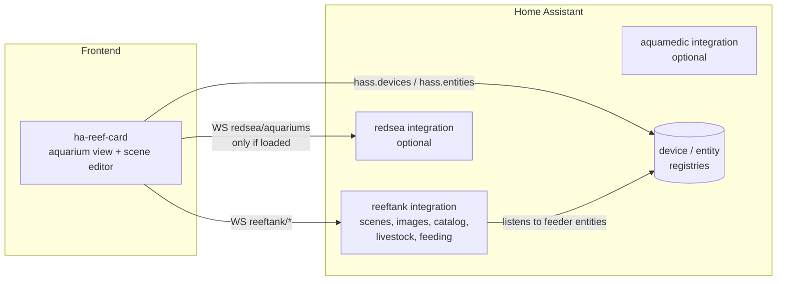

# ha-reeftank-component

Home Assistant integration (domain `reeftank`) backing the **aquarium view** of
[ha-reef-card](https://github.com/Elwinmage/ha-reef-card): a living picture of
your tank, lit by your real lamps, populated with animated fish and corals, and
carrying your devices and entities.

> Status: **v0.1.0, first version** — everything below is implemented.
> Tested with Home Assistant 2026.2 and 2026.10. The fish and coral species are
> downloaded from the [ReefTank catalog](https://github.com/Elwinmage/reeftank-catalog)
> and kept up to date by the `update.reeftank_catalog` entity (§14).

## Quick start

1. Install this integration (HACS, custom repository) and ha-reef-card
   (with the aquarium view), restart Home Assistant.
2. *Settings → Devices & services → Add integration → ReefTank* (one entry,
   nothing to configure).
3. Add a card `custom:reef-aquarium-card` to a dashboard; in its editor,
   *New aquarium* opens the scene editor.
4. Upload a photo of your tank (*Views*), outline the water, drop devices
   and entities on it (*Devices*), choose the lamps (*Light & flow*), add
   the livestock and save.

The species catalog is downloaded on the first start (an internet access to
github.com is needed once), then updated automatically. Add your own species
(see §10) under `<config>/reeftank/catalog/`: they appear in the editor
without restarting, and win over catalog species with the same id.

---

## Table of contents

1. [Overview](#1-overview)
2. [Components and responsibilities](#2-components-and-responsibilities)
3. [Data model](#3-data-model)
4. [Storage](#4-storage)
5. [Backend API](#5-backend-api)
6. [Entities](#6-entities)
7. [Feeding pipeline](#7-feeding-pipeline)
8. [Rendering pipeline](#8-rendering-pipeline)
9. [Light](#9-light)
10. [Sprites and asset pipeline](#10-sprites-and-asset-pipeline)
11. [Fish behaviour](#11-fish-behaviour)
12. [Corals](#12-corals)
13. [Editor](#13-editor)
14. [Asset catalog](#14-asset-catalog)
15. [Performance budget](#15-performance-budget)
16. [Development](#16-development)
17. [Open points](#17-open-points)

---

## 1. Overview

The user picks (or creates) an aquarium, uploads one or more photos of it,
outlines the water regions (main tank, sump) and the decor, drops devices and
entities on the picture, and declares the livestock. The card then renders:

- the photo, with the water region **tinted by the light the lamps produce
  right now** (same colour model as the ReefLED beam);
- **animated fish** swimming with species-specific behaviour, hiding behind the
  decor according to depth, going to sleep at night, rushing to the feeding
  point when food is dropped;
- **animated corals**, recolourable, opening by day and closing at night,
  swaying with the flow of the pumps;
- clickable **devices** (open the device view) and **entities** (existing card
  elements);
- clickable **hotspots** switching to other pictures (e.g. cabinet door open
  showing the sump), each with its own elements.

It must work **without** the `redsea` integration (e.g. Aqua Medic only); Red
Sea cloud data, when available, only pre-fills and filters.

### Render levels

The simulation is optional. Every aquarium renders at one of three levels:

| Level | Shows | Needs in the document | Cost |
|---|---|---|---|
| `static` | Background, devices, entities, hotspots | `views[].image` + `elements` / `hotspots` | No canvas, no animation loop |
| `light` | `static` + light tint of the water regions | + `regions` and `waters[].lights` | One CSS layer, updated on state change |
| `full` | `light` + decor occlusion, corals, fish, feeding animation | + `decor`, `livestock`, `corals` | Canvas + animation loop |

- `static` is a complete, first-class mode, not an unfinished `full`: a
  picture of the cabinet, the sump or the technical room with live devices and
  entities on it — also useful for non-aquarium pictures.
- The level is set per aquarium (`render.level`, default `full`) and can be
  **lowered per card** (`render: static` in the card config), e.g. `full` on the
  desktop, `static` on a weak wall tablet. A card can never raise it.
- A view without `regions` is rendered `static` whatever the level.
- `prefers-reduced-motion` lowers `full` to `light`.
- Livestock, feeding events and their entities do not depend on the render
  level: the inventory and the last-feeding date work in `static` too.
- In the editor, the steps that only matter above `static` (decor, lights,
  livestock placement) are optional and can be skipped.

## 2. Components and responsibilities



| Component | Owns | Does not own |
|---|---|---|
| **`reeftank`** (this repo) | Scenes, uploaded images, asset catalog, livestock, feeding events, entities | Any vendor-specific knowledge |
| **`redsea`** | `redsea/aquariums` WebSocket command: cloud aquariums + linked HA devices | Scene storage |
| **ha-reef-card** | Aquarium view rendering, scene editor, composition of `reeftank` + optional vendor data | Persistence |

**No Python dependency between integrations.** `reeftank` never reads
`hass.data["redsea"]`. The card composes both: it calls `redsea/aquariums`
only when `redsea` is in `hass.config.components`. Other vendors (Aqua Medic…)
may later expose an equivalent command without any change here.

The aquarium view checks that `reeftank` is loaded and shows an
"install the reeftank integration" message otherwise. The other card views do
not depend on it.

## 3. Data model

One **aquarium** document per tank. Key rules:

- **Waters** (main tank, sump…) are separate from **views** (pictures). Two
  views showing the same tank share its livestock and lights.
- **Livestock is the real inventory** (source of truth); rendering derives
  from it and may be capped.
- All picture coordinates are **normalised to the image** (`0..1`), so a photo
  can be replaced by another resolution without breaking anything.
- Depth `z` is numeric (`0` = front glass, `1` = back wall). The editor's
  *front / middle / back* are presets (`0.2 / 0.5 / 0.8`).
- Every document carries a `version` for migrations.

```json
{
  "version": 1,
  "id": "a1b2",
  "name": "Reefer 425",
  "cloud": { "provider": "redsea", "uid": "00000000-…" },
  "preset": "reefer-425-g2",
  "dimensions_cm": { "length": 121.9, "width": 60.9, "height": 40.6 },
  "photo_light": "white",
  "render": { "level": "full", "max_fish": 30, "caustics": false },

  "waters": {
    "main": {
      "lights": [
        { "device_id": "abc", "x": 0.3 },
        { "device_id": "def", "x": 0.7 }
      ],
      "flow": ["number.reefwave_1_speed"],
      "sand_band": 0.12,
      "livestock": [
        { "id": "l1", "kind": "fish", "species": "chromis_viridis", "count": 7,
          "size_cm": [5, 8], "added": "2026-03-14", "note": "" },
        { "id": "l2", "kind": "fish", "species": "cryptocentrus_cinctus",
          "count": 1, "home": [0.72, 0.9, 0.3] }
      ],
      "corals": [
        { "id": "c1", "species": "euphyllia_glabrescens", "view": "front",
          "pos": [0.42, 0.71], "z": 0.5, "size_cm": 10,
          "palette": ["#5c2d91", "#9be564", "#2a7fff"],
          "added": "2026-05-02" }
      ]
    },
    "sump": {
      "lights": [{ "entity_id": "light.refugium", "x": 0.5 }]
    }
  },

  "feeding": {
    "sources": [
      { "id": "f1", "type": "entity", "entity_id": "sensor.feeder_last_feed" },
      { "id": "rs", "type": "entity", "entity_id": "switch.reefbeat_feeding" }
    ],
    "dedup_s": 120,
    "duration_s": 45
  },

  "views": {
    "front": {
      "image": "a1b2/front.webp",
      "regions": [
        { "water": "main",
          "quad": [[0.08, 0.10], [0.92, 0.10], [0.92, 0.55], [0.08, 0.55]],
          "sand": [[0.08, 0.50], [0.40, 0.48], [0.92, 0.49]],
          "sand_back": [], "drawn": false }
      ],
      "backdrop": { "mode": "photo", "rock": null, "sand": null },
      "decor": [
        { "id": "d1", "z": 0.2,
          "poly": [[0.10, 0.50], [0.18, 0.40], [0.25, 0.52]] }
      ],
      "elements": [
        { "kind": "device", "device_id": "abc", "pos": [0.30, 0.04] },
        { "kind": "device", "device_id": "feeder1", "pos": [0.62, 0.08],
          "roles": ["feeding_point"], "source": "f1" },
        { "kind": "entity", "type": "common-sensor",
          "entity_id": "sensor.temp", "pos": [0.85, 0.60] }
      ],
      "hotspots": [
        { "poly": [[0.1, 0.6], [0.9, 0.6], [0.9, 0.95], [0.1, 0.95]],
          "goto": "cabinet" }
      ]
    },
    "cabinet": {
      "image": "a1b2/cabinet.webp",
      "regions": [{ "water": "sump", "quad": [] }],
      "elements": [],
      "hotspots": []
    }
  },
  "default_view": "front"
}
```

Notes:

- `dimensions_cm` uses the Red Sea cloud naming: `length` = X (front, left to
  right), `width` = Y (depth, front glass to back wall), `height` = Z.
- `quad` is a 4-corner quadrilateral (photos are rarely shot square-on); the
  editor starts from a rectangle.
- `sand` is where the sand meets the front glass, as seen on the picture: a
  polyline of 2 points or more, left to right, following its bumps; empty,
  the water's `sand_band` (share of the height) is used. Fish keep above it;
  sand dwellers (`sand` profile) crawl on it.
- `sand_back` is where the sand meets the back wall, as seen on the picture
  (same form), for a picture showing the top of the sand: the sand surface
  goes straight from the front line to the back one (a slope, a bank at the
  back). Empty, the sand is as high at the back as at the front.
- `livestock[].home` is where the animals of a line live (a burrow, a host
  anemone), as `[u, v, z]` in the water: `u` along the front glass, `v` from
  the surface down, `z` from the front glass back, each `0..1`. They stay
  within the territory of their species (`behavior.territory_cm`). In water
  space, so the same home works on every view of the water.
- `regions[].drawn`: the water of that region is drawn (water, sand below
  the sand line, decor polygons filled with rock) instead of shown from the
  picture; the rest of the picture (stand, cabinet, wall) stays. The
  textures are the view's `backdrop.rock` and `backdrop.sand` (catalog ids;
  none: the first of the catalog, else a built-in texture). The editor keeps
  the picture, to outline. (`backdrop.mode: "drawn"`, from a first version,
  draws every region of the view.)
- `lights[].x` is the lamp position along the tank, `0..1`. A light is either
  a `device_id` (ReefLED, G1/G2/virtual) or any `light` `entity_id` with colour
  and brightness.
- `flow` lists speed entities (ReefWave, DC Runner…) that modulate coral sway
  and fish drift.
- `livestock[].count` is the real count; `render.max_fish` caps what is drawn.
  A species without sprites stays in the inventory, unrendered.
- Corals belong to a water, but are positioned on a given `view`.
- A `feeding_point` element references a `feeding.sources[].id`; with no
  `source`, it reacts to any feeding of that aquarium.

## 4. Storage

Nothing heavy goes in the Lovelace configuration. The card config is only:

```yaml
type: custom:reef-card
view: aquarium
aquarium: a1b2
render: static      # optional: lowers the aquarium's render level on this card
```

| What | Where | Why |
|---|---|---|
| Aquarium documents | `Store` → `.storage/reeftank` | Versioned, migrated, in HA backups |
| Uploaded photos | `/config/reeftank/<aquarium_id>/` | In HA backups; served by a static path |
| Downloaded catalog | `/config/reeftank/pack/` | Species of the catalog releases, replaced by updates |
| User catalog additions | `/config/reeftank/catalog/` | Custom species, merged over the downloaded ones |

Static paths: `/reeftank/images/…`, `/reeftank/catalog/pack/…` and
`/reeftank/catalog/user/…`.

### Background photo uploads

User photos are normalised server-side before being stored:

| Step | Rule |
|---|---|
| Accepted input | JPEG, PNG, WebP; HEIC/HEIF through `pillow-heif` when installed |
| Max upload size | 20 MB (rejected above) |
| Orientation | EXIF orientation applied, then dropped (phone photos are often stored rotated) |
| Metadata | All EXIF stripped on re-encode — phone photos carry GPS coordinates |
| Resolution | Long edge capped at 2560 px |
| Output | WebP, quality ~85 |

Catalog assets (atlases, preset pictures) are not uploads: they are produced by
the build script of reeftank-catalog in their final format.

## 5. Backend API

### WebSocket commands

| Command | Payload | Returns |
|---|---|---|
| `reeftank/aquarium/list` | — | `[{id, name, revision, preset, cloud, render_level, views}]` |
| `reeftank/aquarium/get` | `{aquarium_id}` | `{document, entities, images_url}` |
| `reeftank/aquarium/subscribe` | `{aquarium_id}` | the same payload now and on every change; `{deleted: true}` |
| `reeftank/aquarium/save` (admin) | `{document, expected_revision?}` | `{document, entities, images_url}`; error `conflict` when the revision moved, `invalid_format` |
| `reeftank/aquarium/delete` (admin) | `{aquarium_id}` | — (removes device, entities, pictures) |
| `reeftank/catalog` | — | merged catalog (downloaded + user), asset names turned into URLs; `pack: {version, updating}` |
| `reeftank/catalog/subscribe` | — | an event `{version}` each time a catalog release is installed |

`entities` gives the entity ids of the aquarium's own entities (§6), so the
card follows `event.<tank>_feeding` without guessing its name.

Pictures are uploaded over HTTP (admin only): `POST /api/reeftank/upload/<aquarium_id>`,
multipart field `file` → `{path, url, width, height}`. The aquarium may not
exist yet: the editor gives a new aquarium its id before saving it.

### Services

| Service | Fields | Effect |
|---|---|---|
| `reeftank.feed` | `aquarium`, `source?` | Fires the feeding event (for feeders not in HA, scripts…) |
| `reeftank.livestock_add` | `aquarium`, `water?`, `species`, `count?`, `kind?`, `size_cm?`, `note?` | Adds to / creates an inventory line |
| `reeftank.livestock_remove` | `aquarium`, `line_id` or `species`, `count?` | Decreases a line (losses, rehoming); removes it at 0 |

`aquarium` is the aquarium's id, its name or its device id.

### Provided by `redsea` (separate repo)

`redsea/aquariums` returns, for every configured cloud account:

```json
[{ "provider": "redsea", "account": "me@example.com",
   "uid": "…", "name": "Aquarium 1",
   "system_model": "…", "system_series": "reefer", "system_type": "mixed-reef",
   "dimensions_cm": { "length": 121.92, "width": 60.96, "height": 40.64 },
   "water_volume": 80, "net_water_volume": 120, "measuring_unit": "gallons",
   "device_ids": ["<ha device id>", "…"],
   "feeding_entities": ["switch.…_feeding_1"] }]
```

`device_ids` is the join of the cloud `/device` list (`aquarium_uid`, `hwid`)
with the HA device registry, done server-side so the card does not repeat it.
`feeding_entities` are the aquarium's feeding shortcut switches, offered as
feeding sources.

## 6. Entities

Each aquarium is an HA **device** of `reeftank`; its entities are created and
removed with it (unique ids derived from the aquarium id).

| Entity | State | Attributes |
|---|---|---|
| `sensor.<tank>_fish` | Total fish count | `{species: count}`, `species_count` |
| `sensor.<tank>_corals` | Total coral count | `{species: count}`, `species_count` |
| `event.<tank>_feeding` | Timestamp of the last feeding | `event_type`: `feeder` / `shortcut` / `manual`; `source` |
| `sensor.<tank>_feedings_today` | Feedings since local midnight | — |

- The population history comes for free from the recorder on the count
  sensors.
- `event.<tank>_feeding` is an `EventEntity`: its state *is* the last trigger
  time, restored across restarts, usable in automations.

## 7. Feeding pipeline

```
feeder entity change ─┐
redsea feeding switch ┼─► reeftank (dedup window) ─► event.<tank>_feeding
reeftank.feed service ┘                                   │
                                                          ▼
                                       card watches the entity state
                                                          │
                       particles fall from the matching feeding point(s)
                       fish attraction weighted by species `feeding_response`
                       effect decays over `duration_s`
```

- Triggers are handled **server-side**, so feedings are recorded even when no
  card is open.
- `dedup_s` merges triggers that fire together (feeder + feeding shortcut).
- The `source` attribute of the event selects the feeding point; without one,
  the first feeding point of the view is used.
- Food particles drift with the current flow.

## 8. Rendering pipeline

Four layers, bottom to top:

1. **Background** — the view's photo in an `` (free).
2. **Life canvas** — one `<canvas>`; every frame draws a single list sorted by
   descending `z`, mixing:
   - fish sprites,
   - coral sprites,
   - **decor cut-outs**: the photo clipped by each decor polygon, pre-rendered
     once into an offscreen canvas.

   A fish at `z = 0.7` is drawn before a decor at `z = 0.5`, hence hidden
   behind it — occlusion needs no special case. Far objects are drawn smaller
   and slightly blue-shifted (depth haze).
3. **Light tint** — a `div` with `mix-blend-mode`, clipped (`clip-path`) to
   the water quad. GPU-composited; updated only when the light state changes.
   It tints the fish too, which is what real actinic light does.
4. **Elements** — Lit DOM: devices, entities (existing card elements and
   mapping format), hotspots. Not tinted.

Technology: **Canvas 2D**, no WebGL library (keeps the card's dependencies to
`lit` and `@mdi/js`).

## 9. Light

- Reuses `light_color()` / `is_dark()` from `rsled_program` / `rsled_beam`:
  the tank and the beam always agree, for G1, G2 and virtual LEDs.
- Several lamps → a **horizontal gradient** mixing each lamp's colour and
  intensity at its `x`; a **vertical gradient** darkens and blues the bottom.
- Intensity drives a darkening veil; moon mode at night; near-black when off.
- `photo_light` (`white` / `blue`) compensates the lighting baked in the
  photo, so a bluish photo does not turn purple.
- Optional **caustics** texture, modulated by intensity and flow; off by
  default (costly on tablets).
- The sump (or any water) can use any `light` entity, e.g. a refugium light.

## 10. Sprites and asset pipeline

### Why not APNG (or animated WebP, or video)

- No playback control: speed, pause or start frame cannot be set, so tail
  beats cannot follow the swimming speed.
- Browsers share one animation timeline per image resource: a shoal would beat
  its tails in perfect sync.
- Canvas `drawImage` of an animated image draws the first or the current
  frame depending on the browser — never the one you choose.
- VP9 video with alpha is not supported by Safari (iOS companion app).

### Chosen format: sprite sheet (atlas) + JSON descriptor

- Atlas: **WebP with alpha**, frames on a grid.
- Each fish computes its own frame: `frame = phase + t × speed_factor` —
  desynchronised and speed-linked.
- One decode, works everywhere, ~100 KB for 24 frames of 256×128.
- One resolution by default (frames of 256×128 for a fish, 256×256 for a
  coral, plenty for the size they are drawn at); `--hd` also writes a double
  resolution atlas, which the card does not use yet.

### Authoring

Atlases are built from generated clips by `scripts/build_atlas.py` of the
[reeftank-catalog](https://github.com/Elwinmage/reeftank-catalog) repository
(automatic mode, batches, loops, turn detection): see its README. The same
script builds your own species for `<config>/reeftank/catalog/`.

- `swim` loops; its rate follows the swimming speed.
- `idle` (optional) plays when the fish barely moves, at its own rate;
  `pingpong` suits clips generated as a forward-then-backward loop.
- `turn` (optional) plays once, from the drawn way to the other one; the card
  plays it as is or mirrored, and its length sets the turn duration
  (0.25–3 s).
- The card cross-fades for 0.15 s when a fish changes clip, which hides the
  small pose differences between clips generated separately.

### Descriptor

```json
{
  "id": "chromis_viridis",
  "kind": "fish",
  "atlas": { "1x": "chromis_viridis.webp" },
  "frame": [224, 124],
  "columns": 8,
  "facing": "right",
  "length_frac": 0.857,
  "clips": {
    "swim": { "from": 0, "to": 23, "fps": 24, "loop": true },
    "turn": { "from": 24, "to": 31, "fps": 24, "loop": false },
    "idle": { "from": 32, "to": 43, "fps": 12, "loop": true, "pingpong": true }
  },
  "size_cm": [5, 8],
  "behavior": { "profile": "shoal", "depth": [0.2, 0.8], "band": [0.1, 0.7],
                "speed_cm_s": [4, 12], "turn_rate": 2.5,
                "shoal": { "cohesion": 1.0, "alignment": 0.8, "separation": 1.2 } },
  "night": "hide",
  "feeding_response": 1.0,
  "names": { "en": "Blue-green chromis", "fr": "Chromis vert" }
}
```

- `turn` is optional: without it, a turn is a horizontal squash from +1 to −1.
- `facing` tells which way the source frames look.
- `length_frac`: share of the frame width taken by the fish length (1 when
  absent): the card scales the frame so that the fish has its size in cm.

## 11. Fish behaviour

Lightweight boids, driven by the species profile:

| Profile | Example | Logic |
|---|---|---|
| `shoal` | Chromis viridis | Cohesion, alignment, separation with its kind |
| `cruiser` | Tangs | Open water, long paths |
| `benthic` | Mandarin | Targets inside decor polygons and the sand band; slow moves with stops |
| `hover` | Gobies, clowns | Stays around an anchor point |

- **Scale**: `dimensions_cm` + the water quad give `px/cm`, so `size_cm` is
  consistent with the photo.
- **Depth**: fish move in `z` too; scale and haze follow.
- **Night** (`is_dark()` of the water's lights, with a twilight ramp):
  `hide` (swim to the nearest decor, go behind it, fade), `hover`,
  `rest_bottom`.
- **Flow**: speed entities add drift.
- **Feeding**: attraction to the feeding point / nearest particle, weighted by
  `feeding_response` (tang 1.0, chromis 0.8, mandarin 0.0…).
- **Seeded RNG** per aquarium, so a re-render does not teleport fish.
- Fixed simulation timestep, decoupled from the frame rate.

## 12. Corals

Fixed position, `size_cm`, `z`, and a **palette of 3–4 indexed colours**.

Each coral species has two atlases:

- `shade.webp` — luminance (grey levels) + alpha;
- `mask.png` — **lossless**; R, G, B = weights of colours 1, 2, 3; colour 4 =
  remainder. Weights allow soft transitions between zones.

`pixel = shade × Σ wᵢ × colourᵢ`, computed **once** (on load or palette
change) into a cached atlas; animation only blits.

Clips: `day` (loop), `close` (transition), `night` (loop); opening is `close`
played backwards. Animation speed follows the flow.

Optional `fluo` flag per colour: those zones are drawn after the tint and
glow under actinic light.

```json
{
  "id": "euphyllia_glabrescens",
  "kind": "coral",
  "atlas": { "shade": "euphyllia_glabrescens.shade.webp",
             "mask": "euphyllia_glabrescens.mask.png" },
  "frame": [256, 256],
  "columns": 8,
  "clips": {
    "day":   { "from": 0,  "to": 31, "fps": 12, "loop": true },
    "close": { "from": 32, "to": 47, "fps": 12 },
    "night": { "from": 48, "to": 55, "fps": 6,  "loop": true }
  },
  "palette": [
    { "default": "#2f8f3a", "fluo": false },
    { "default": "#9be564", "fluo": true },
    { "default": "#2a7fff", "fluo": true }
  ],
  "size_cm": [5, 20]
}
```

## 13. Editor

The Lovelace card editor only holds the aquarium choice and an
**"Edit scene"** button opening a **full-screen dialog** (the card editor panel
is too narrow for outlining).

### Steps

1. **Aquarium** — pick a cloud aquarium (via `redsea/aquariums` when loaded),
   an existing one, or create one (name, dimensions). A cloud aquarium
   pre-selects the matching preset (`system_series` + `system_model`,
   fallback on dimensions).
2. **Pictures** — upload one or more photos, or take the preset's; outline the
   main tank and/or sump with a 4-corner quad.
3. **Decor** — polygon tool (click points, double-click to close, drag
   vertices) and lasso (simplified with Ramer–Douglas–Peucker); depth preset
   front / middle / back (numeric `z` underneath).
4. **Devices & entities** — tree built from `hass.devices` + `hass.entities`:

   ```
   redsea
     └ RSLED-1100000
         ├ light.blue
         ├ switch.state
         └ sensor.white
   aquamedic
     └ DC Runner #1
         └ sensor.speed
   other
     └ …
   ```

   Grouped by integration (`identifiers[0]`), sub-devices nested (ReefRun
   pumps, dosing heads). Red Sea is filtered to the aquarium's `device_ids`
   when known, with a "show all" toggle. **Pointer Events** drag-and-drop
   (HTML5 DnD does not work on touch).
   - device → device thumbnail (existing card images), click opens
     `show_device`;
   - entity → existing card element (`common-sensor`, `switch`…);
   - role `feeding_point` + feeding source on any device or bare marker.
5. **Lights & flow** — assign lamps to waters and drag their `x`; pick flow
   entities.
6. **Hotspots** — polygons switching to another view.
7. **Livestock** — *Add fish*: species, count, size range; corals: species,
   size, palette, placed by drag on a view.

## 14. Asset catalog

```
catalog/
  presets/
    reefer-425-g2/
      preset.json       # match keys, dimensions, views (images, quads, decor)
      front.webp
  fish/
    siganus_vulpinus/
      species.json
      siganus_vulpinus.webp
      thumb.webp        # small picture for the editor's lists
  corals/
    euphyllia_glabrescens/
      species.json
      euphyllia_glabrescens.shade.webp
      euphyllia_glabrescens.mask.png
      thumb.webp
  textures/
    live_rock/
      texture.json      # {"role": "rock" | "sand", "image": "live_rock.webp",
                        #  "scale_cm": 30}: the picture covers 30 cm of tank
      live_rock.webp    # tileable
```

Folders are scanned on every `reeftank/catalog` call (no index to keep up to
date); a folder name is the entry id. Two catalogs are merged:

- the **downloaded** one, `/config/reeftank/pack/`, from the releases of
  [reeftank-catalog](https://github.com/Elwinmage/reeftank-catalog) (fish and
  corals);
- the **user** one, `/config/reeftank/catalog/` (same layout), whose entries
  override downloaded ones with the same id.

Nothing from the catalog goes in the card's JS bundle.

### Catalog updates

Every release of reeftank-catalog holds a `manifest.json` (format, version,
minimum integration version, notes, and per entry: version, sha256, size,
archive name) and one zip archive per entry.

- **`update.reeftank_catalog`** (device *ReefTank catalog*) shows the
  installed and the latest release, with its notes. The latest release is
  checked every 12 hours (`…/releases/latest/download/manifest.json`, no API
  rate limit).
- **`button.reeftank_catalog_check_for_updates`** (same device, *Check for
  updates*) checks right away; a release found is installed at once when
  automatic updates are on.
- **Automatic** by default: a new release is installed as soon as it is seen.
  *Settings → Devices & services → ReefTank → Configure* turns it off; the
  entity then waits for *Install*.
- **Incremental**: only the entries whose sha256 changed are downloaded; the
  others are copied from the installed pack.
- **Safe**: archives are checked (size and sha256 from the manifest, flat file
  names, `json`/`webp`/`png` only, bounded sizes, a descriptor that parses),
  the new pack is prepared next to the old one, then put in its place in one
  move: an interrupted update leaves the previous pack untouched.
- A release needing a newer integration (`min_integration`) is not installed;
  the entity says so.
- A pack whose files are missing (a backup restored without it, a folder
  deleted by hand) counts as not installed, and is downloaded again.
- Cards refresh their catalog when a release is installed
  (`reeftank/catalog/subscribe`).

A preset is matched to a cloud aquarium on its model, then its series, then
its dimensions (±3 cm):

```json
{
  "name": "Reefer 425 G2+",
  "match": { "provider": "redsea", "models": ["Reefer 425 G2+"], "series": ["reefer"] },
  "dimensions_cm": { "length": 121.9, "width": 60.9, "height": 50.8 },
  "views": {
    "front": {
      "name": "Front",
      "image": "front.webp",
      "regions": [{ "water": "main", "quad": [[0.1, 0.1], [0.9, 0.1], [0.9, 0.6], [0.1, 0.6]] }]
    }
  },
  "default_view": "front"
}
```

## 15. Performance budget

Target: low-end wall tablets.

- 30 fps cap; fixed simulation step.
- Paused when off-screen (`IntersectionObserver`) or tab hidden
  (`visibilitychange`).
- `prefers-reduced-motion` respected; per-card "animations off" option.
- `devicePixelRatio` capped (e.g. 2).
- `render.max_fish` cap (default 30); caustics off by default.
- Decor cut-outs and recoloured coral atlases pre-rendered and cached.
- Canvas resized through `ResizeObserver` only.

## 16. Development

```bash
pip install -r requirements.test.txt
pytest --cov=custom_components.reeftank --cov-config=.coveragerc   # 100 % expected
ruff check . && ruff format --check .
pyright --project pyrightconfig.json
python scripts/check_translation.py
```

Next steps:

- more species in reeftank-catalog;
- Red Sea tank presets (`catalog/presets/`), once picture rights are clear;
- optional caustics layer (`render.caustics`, stored but not drawn yet).

## 17. Open points

- **Red Sea preset pictures**: redistribution rights of Red Sea product photos
  to be checked; fallback on own photos or drawn renders. (Fish and coral clips
  are produced by the project, under CC BY 4.0 in reeftank-catalog.)
- **Multiple cloud accounts** with the same aquarium name: disambiguation in
  the picker.
