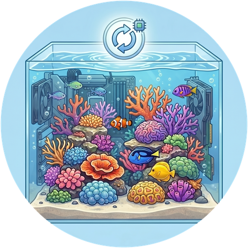

# ReefTank 🐟
> Part of the [**ReefTech Project Ecosystem**](https://elwinmage.github.io/reeftank/)
<p align="center">
  
</p>

[](https://github.com/hacs/hacs)
[](https://developers.home-assistant.io/docs/architecture_index/#branding)
[](https://github.com/Elwinmage/ha-reeftank-component/releases)

[](https://github.com/Elwinmage/ha-reeftank-component/actions/workflows/main.yml)
[](https://github.com/Elwinmage/ha-reeftank-component/actions/workflows/hass_and_hacs.yml)
[](https://app.codecov.io/gh/Elwinmage/ha-reeftank-component)
[](https://github.com/Elwinmage/ha-reeftank-component/commits/main)
[](https://github.com/MShawon/github-clone-count-badge)
[](https://opensource.org/licenses/MIT)
[](https://github.com/Elwinmage/ha-reeftank-component)
[](https://paypal.me/Elwinmage)

# Supported Languages:  [](https://github.com/Elwinmage/ha-reeftank-component/blob/main/doc/fr/README.fr.md) [](https://github.com/Elwinmage/ha-reeftank-component/blob/main/doc/de/README.de.md) [](https://github.com/Elwinmage/ha-reeftank-component/blob/main/doc/es/README.es.md) [](https://github.com/Elwinmage/ha-reeftank-component/blob/main/doc/it/README.it.md) [](https://github.com/Elwinmage/ha-reeftank-component/blob/main/doc/nl/README.nl.md) [](https://github.com/Elwinmage/ha-reeftank-component/blob/main/doc/pl/README.pl.md) [](https://github.com/Elwinmage/ha-reeftank-component/blob/main/doc/pt/README.pt.md)

Home Assistant integration behind the **aquarium card** of [ha-reef-card](https://github.com/Elwinmage/ha-reef-card): a living picture of your tank, lit by your real lamps, populated with animated fish and corals, and carrying your devices and entities.

It stores the aquariums, their pictures and their livestock, records the feedings, and keeps the species catalog up to date. Nothing vendor-specific: it works with Red Sea, Aqua Medic or any other equipment Home Assistant knows.

<p align="center">
  
</p>

<!-- ecosystem:start -->

## Related projects

The ReefTech projects fit together: the integrations bring your equipment into Home Assistant, the card displays and drives it, and the backup keeps it running through an outage. Each one also works on its own.

<table>
  <tr>
    <th width="100px"></th>
    <th>Project</th>
    <th>What it does</th>
    <th>Works with</th>
  </tr>
  <tr>
    <td></td>
    <td>🐠<br /><a href="https://github.com/Elwinmage/ha-reefbeat-component"><b>ha-reefbeat-component</b></a></td>
    <td>Red Sea ReefBeat devices, controlled locally with no cloud: ReefATO+, ReefControl, ReefControl-Power, ReefDose, ReefLed, ReefMat, ReefRun and ReefWave.<br />alert blueprint for abnormal modes, calibrations and low battery. <a href="https://my.home-assistant.io/redirect/blueprint_import/?blueprint_url=https://raw.githubusercontent.com/Elwinmage/ha-reefbeat-component/refs/heads/main/blueprints/automation/redsea_alerts.en.yaml"></a></td>
    <td>ha-reef-card</td>
  </tr>
  <tr>
    <td></td>
    <td>🌊<br /><a href="https://github.com/Elwinmage/ha-aquamedic-component"><b>ha-aquamedic-component</b></a></td>
    <td>Aqua Medic pumps through the Gizwits cloud API: EcoDrift and SmartDrift wavemakers, DC Runner return and skimmer pumps.</td>
    <td>ha-reef-card</td>
  </tr>
  <tr>
    <td></td>
    <td>🐙<br /><a href="https://github.com/Elwinmage/ha-reef-maintenance-component"><b>ha-reef-maintenance-component</b></a></td>
    <td>Cleaning and wear tracking for the equipment Home Assistant cannot talk to: flow pumps, return pumps, skimmers, media reactors, anything you service by hand.</td>
    <td>ha-reef-card</td>
  </tr>
  <tr>
    <td></td>
    <td>🪸<br /><a href="https://github.com/Elwinmage/ha-reef-card"><b>ha-reef-card</b></a></td>
    <td>Interactive graphical view of each device on your dashboard, and the only way to edit advanced schedules. Reads the three integrations above through the shared <code>reef_role</code> contract, with no card-side configuration. Also draws the power flows of reefbeatEnergyBackup. Its aquarium card brings your tank to life with ha-reeftank-component.</td>
    <td>all three integrations, and ha-reeftank-component for the aquarium</td>
  </tr>
  <tr>
    <td></td>
    <td>🐟<br /><b>ha-reeftank-component</b><br /><i>(this repository)</i></td>
    <td>A living picture of your tank on the dashboard: your photo, lit by your real lamps, with animated fish and corals, and your devices and entities on it. Stores the aquariums and their livestock, records the feedings.</td>
    <td>ha-reef-card</td>
  </tr>
  <tr>
    <td></td>
    <td>🐡<br /><a href="https://github.com/Elwinmage/reeftank-catalog"><b>reeftank-catalog</b></a></td>
    <td>Fish, corals and textures of the aquarium card, downloaded and kept up to date by ha-reeftank-component.</td>
    <td>ha-reeftank-component</td>
  </tr>
  <tr>
    <td></td>
    <td>🐬<br /><a href="https://github.com/Elwinmage/ha-reef-blueprints"><b>ha-reef-blueprints</b></a></td>
    <td>Notification blueprints shared by the whole ecosystem: overdue maintenance found through the <code>reef_role</code> contract, and devices that went unreachable. Eight languages.</td>
    <td>all three integrations</td>
  </tr>
  <tr>
    <td></td>
    <td>⚡<br /><a href="https://github.com/Elwinmage/reefbeatEnergyBackup"><b>reefbeatEnergyBackup</b></a></td>
    <td>Battery backup for power outages. A 24V LiFePO₄ pack driven by a Raspberry Pi, with pump speed degraded progressively according to the state of charge.</td>
    <td>standalone, or alongside ha-reefbeat-component and ha-reef-card</td>
  </tr>
</table>

All of them are documented together on the [ReefTech project page](https://elwinmage.github.io/reeftank/).

<!-- ecosystem:end -->

## Features

- **Your photo, alive**: outline the water on a picture of your tank, the card animates it
- **Real light**: the water takes the colour and the intensity of your lamps (ReefLED or any `light`), dimmed at night but still readable
- **Fish and corals** from the [ReefTank catalog](https://github.com/Elwinmage/reeftank-catalog): shoals, open-water swimmers, sand dwellers, gobies peeking out of their burrow, corals swaying with the pumps
- **Depth**: fish swim behind the rocks you outlined, and rest on the sand at night
- **Drawn tank**: no nice picture of the water? Draw it (water, sand, rock textures) and keep the rest of the photo
- **Devices and entities** dropped on the picture, clickable; zones that open another picture (the sump in the cabinet)
- **Feeding**: feeders, Red Sea shortcuts or a service record each feeding; the fish rush to the feeding point
- **Inventory**: fish and coral counts as sensors, with their history

## Installation

### Direct installation

Click here to open the repository directly in HACS and click "Download": [](https://my.home-assistant.io/redirect/hacs_repository/?owner=Elwinmage&repository=ha-reeftank-component&category=integration)

### Search in HACS

Or add `https://github.com/Elwinmage/ha-reeftank-component` as a custom repository (Integration) and search for "ReefTank".

Restart Home Assistant, then add the integration (one entry, nothing to configure): [](https://my.home-assistant.io/redirect/config_flow_start/?domain=reeftank)

The aquarium card itself comes with [ha-reef-card](https://github.com/Elwinmage/ha-reef-card), to install as well.

## Getting started

1. Add a **Reef Aquarium Card** to a dashboard (`custom:reef-aquarium-card`).
2. In its editor, create an aquarium (**New aquarium**), then **Edit the scene**.
3. **Views**: upload a photo of your tank, outline the water, trace the sand line and the rocks.
4. **Devices** and **Light & flow**: drop your devices and entities on the picture, place your lamps.
5. **Livestock**: add your fish and corals, then save.

The card configuration only holds the aquarium id; everything else is stored by the integration:

```yaml
type: custom:reef-aquarium-card
aquarium: a1b2        # set by the card editor
view: front           # optional
render: static        # optional: static, light or full
```

## The scene editor

A full-screen dialog, opened from the card editor, with six tabs:

| Tab | What you do there |
|---|---|
| **Aquarium** | Name, dimensions, the matching cloud aquarium, light the photos were taken under, render level |
| **Views** | Pictures; for each water: outline, sand line (front and back), rocks with their depth, clickable zones, drawn background and its textures |
| **Devices** | Your devices and entities by floor and area, dragged onto the picture |
| **Light & flow** | Lamps lighting each water and their position; pumps that make the water move |
| **Livestock** | Fish (species, count, size, home) and corals (species, size, colours, position) |
| **Feeding** | Entities that record a feeding, and where the food falls |

## Render levels

Each aquarium renders at one of three levels; a card can lower it, e.g. on a slow wall tablet:

| Level | Shows |
|---|---|
| **Static** (`static`) | picture, devices and entities |
| **Light** (`light`) | plus the colour of the lamps |
| **Full** (`full`) | plus fish and corals |

A picture of the technical room with live devices on it is a perfectly good `static` aquarium.

## Entities

Each aquarium is a device with:

| Entity | State |
|---|---|
| `sensor.<aquarium>_fish` | Number of fish, per species in the attributes |
| `sensor.<aquarium>_corals` | Number of corals, per species in the attributes |
| `event.<aquarium>_feeding` | Last feeding, with its kind (feeder, shortcut, manual) and source |
| `sensor.<aquarium>_feedings_today` | Feedings since midnight |

And the *ReefTank catalog* device:

| Entity | State |
|---|---|
| `update.reeftank_catalog` | Installed and latest catalog release |
| `button.reeftank_catalog_check_for_updates` | Checks for a new release right away |

## Services

| Service | Effect |
|---|---|
| `reeftank.feed` | Records a feeding (feeders unknown to Home Assistant, scripts) |
| `reeftank.livestock_add` | Adds animals to the inventory |
| `reeftank.livestock_remove` | Removes animals (losses, rehoming) |

`aquarium` is the aquarium's name, id or device id.

```yaml
action: reeftank.livestock_add
data:
  aquarium: Reefer 425
  species: chromis_viridis
  count: 3
```

## Species catalog

Fish, corals and textures come from the [ReefTank catalog](https://github.com/Elwinmage/reeftank-catalog), downloaded on the first start (github.com must be reachable once), then kept up to date:

- a new release is installed automatically; *Settings → Devices & services → ReefTank → Configure* turns this off;
- `button.reeftank_catalog_check_for_updates` checks right away instead of waiting for the next check (every 12 hours);
- only what changed is downloaded, and an interrupted update leaves the previous catalog in place.

Your own species go in `<config>/reeftank/catalog/` (same layout as the catalog): they appear in the editor without restarting.

## Technical reference

Data model, WebSocket API, rendering pipeline, fish behaviour, sprite format and catalog updates: [technical reference](doc/en/technical.md) (in English).

## Development

The test suite covers the integration fully and CI keeps it that way. `scripts/gen_readme.py` regenerates this page and its seven translations: edit it, not the generated files.

```bash
pip install -r requirements.test.txt
pytest -q --cov=custom_components.reeftank --cov-config=.coveragerc
ruff check . && ruff format --check .
pyright --project pyrightconfig.json
python3 scripts/check_translation.py
python3 scripts/gen_readme.py
```
