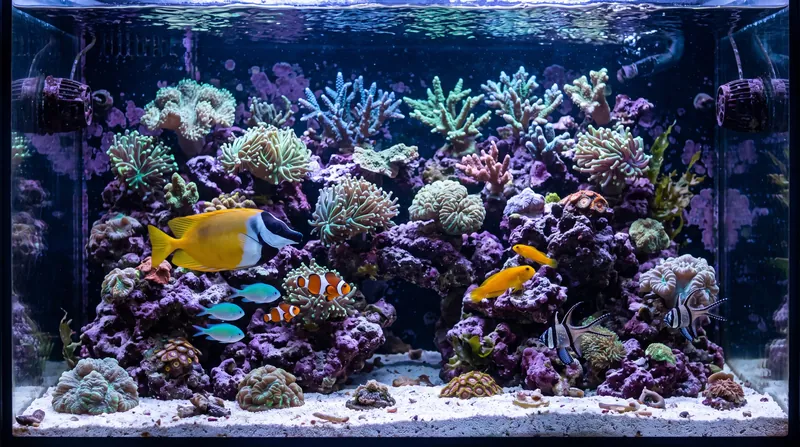

# ReefTank 🐟
> Parte del [**ecosistema de proyectos ReefTech**](https://elwinmage.github.io/reeftank/)
<p align="center">
  
</p>

[](https://github.com/hacs/hacs)
[](https://developers.home-assistant.io/docs/architecture_index/#branding)
[](https://github.com/Elwinmage/ha-reeftank-component/releases)

[](https://github.com/Elwinmage/ha-reeftank-component/actions/workflows/main.yml)
[](https://github.com/Elwinmage/ha-reeftank-component/actions/workflows/hass_and_hacs.yml)
[](https://app.codecov.io/gh/Elwinmage/ha-reeftank-component)
[](https://github.com/Elwinmage/ha-reeftank-component/commits/main)
[](https://github.com/MShawon/github-clone-count-badge)
[](https://opensource.org/licenses/MIT)
[](https://github.com/Elwinmage/ha-reeftank-component)
[](https://paypal.me/Elwinmage)

# Idiomas disponibles: [](https://github.com/Elwinmage/ha-reeftank-component/blob/main/README.md) [](https://github.com/Elwinmage/ha-reeftank-component/blob/main/doc/fr/README.fr.md) [](https://github.com/Elwinmage/ha-reeftank-component/blob/main/doc/de/README.de.md)  [](https://github.com/Elwinmage/ha-reeftank-component/blob/main/doc/it/README.it.md) [](https://github.com/Elwinmage/ha-reeftank-component/blob/main/doc/nl/README.nl.md) [](https://github.com/Elwinmage/ha-reeftank-component/blob/main/doc/pl/README.pl.md) [](https://github.com/Elwinmage/ha-reeftank-component/blob/main/doc/pt/README.pt.md)

Integración de Home Assistant detrás de la **tarjeta de acuario** de [ha-reef-card](https://github.com/Elwinmage/ha-reef-card): una imagen viva de su acuario, iluminada por sus lámparas reales, poblada de peces y corales animados, y con sus dispositivos y entidades encima.

Guarda los acuarios, sus imágenes y su fauna, registra las alimentaciones y mantiene al día el catálogo de especies. Nada propio de una marca: funciona con Red Sea, Aqua Medic o cualquier otro equipo que Home Assistant conozca.

<p align="center">
  
</p>

<!-- ecosystem:start -->

## Proyectos relacionados

Los proyectos ReefTech encajan entre sí: las integraciones traen tu equipo a Home Assistant, la tarjeta lo muestra y lo controla, y el respaldo lo mantiene en marcha durante un corte. Cada uno funciona también por su cuenta.

<table>
  <tr>
    <th width="100px"></th>
    <th>Proyecto</th>
    <th>Función</th>
    <th>Funciona con</th>
  </tr>
  <tr>
    <td></td>
    <td>🐠<br /><a href="https://github.com/Elwinmage/ha-reefbeat-component"><b>ha-reefbeat-component</b></a></td>
    <td>Dispositivos Red Sea ReefBeat, controlados localmente sin cloud: ReefATO+, ReefControl, ReefControl-Power, ReefDose, ReefLed, ReefMat, ReefRun y ReefWave.<br />blueprint de alertas para modos anómalos, calibraciones y batería baja. <a href="https://my.home-assistant.io/redirect/blueprint_import/?blueprint_url=https://raw.githubusercontent.com/Elwinmage/ha-reefbeat-component/refs/heads/main/blueprints/automation/redsea_alerts.en.yaml"></a></td>
    <td>ha-reef-card</td>
  </tr>
  <tr>
    <td></td>
    <td>🌊<br /><a href="https://github.com/Elwinmage/ha-aquamedic-component"><b>ha-aquamedic-component</b></a></td>
    <td>Bombas Aqua Medic a través de la API cloud Gizwits: bombas de movimiento EcoDrift y SmartDrift, bombas DC Runner de retorno y de skimmer.</td>
    <td>ha-reef-card</td>
  </tr>
  <tr>
    <td></td>
    <td>🐙<br /><a href="https://github.com/Elwinmage/ha-reef-maintenance-component"><b>ha-reef-maintenance-component</b></a></td>
    <td>Seguimiento de limpieza y desgaste del equipo que Home Assistant no puede consultar: bombas de movimiento, bombas de retorno, skimmers, reactores, todo lo que mantienes a mano.</td>
    <td>ha-reef-card</td>
  </tr>
  <tr>
    <td></td>
    <td>🪸<br /><a href="https://github.com/Elwinmage/ha-reef-card"><b>ha-reef-card</b></a></td>
    <td>Vista gráfica interactiva de cada dispositivo en tu panel, y la única forma de editar programaciones avanzadas. Lee las tres integraciones mediante el contrato <code>reef_role</code> común, sin configuración del lado de la tarjeta. También dibuja los flujos de energía de reefbeatEnergyBackup. Su tarjeta de acuario da vida a su acuario con ha-reeftank-component.</td>
    <td>las tres integraciones, y ha-reeftank-component para el acuario</td>
  </tr>
  <tr>
    <td></td>
    <td>🐟<br /><b>ha-reeftank-component</b><br /><i>(este repositorio)</i></td>
    <td>Una imagen viva de su acuario en el panel: su foto, iluminada por sus lámparas reales, con peces y corales animados, y sus dispositivos y entidades encima. Guarda los acuarios y su fauna, registra las alimentaciones.</td>
    <td>ha-reef-card</td>
  </tr>
  <tr>
    <td></td>
    <td>🐡<br /><a href="https://github.com/Elwinmage/reeftank-catalog"><b>reeftank-catalog</b></a></td>
    <td>Peces, corales y texturas de la tarjeta de acuario, descargados y mantenidos al día por ha-reeftank-component.</td>
    <td>ha-reeftank-component</td>
  </tr>
  <tr>
    <td></td>
    <td>🐬<br /><a href="https://github.com/Elwinmage/ha-reef-blueprints"><b>ha-reef-blueprints</b></a></td>
    <td>Blueprints de notificación comunes a todo el ecosistema: mantenimientos vencidos encontrados por el contrato <code>reef_role</code>, y dispositivos que dejaron de responder. Ocho idiomas.</td>
    <td>las tres integraciones</td>
  </tr>
  <tr>
    <td></td>
    <td>⚡<br /><a href="https://github.com/Elwinmage/reefbeatEnergyBackup"><b>reefbeatEnergyBackup</b></a></td>
    <td>Respaldo por batería ante cortes de luz. Un pack 24V LiFePO₄ gobernado por una Raspberry Pi, con degradación progresiva de la velocidad de las bombas según el estado de carga.</td>
    <td>por su cuenta, o junto a ha-reefbeat-component y ha-reef-card</td>
  </tr>
</table>

Todos están documentados juntos en la [página del proyecto ReefTech](https://elwinmage.github.io/reeftank/).

<!-- ecosystem:end -->

## Funciones

- **Su foto, viva**: contornee el agua en una foto de su acuario y la tarjeta la anima
- **Luz real**: el agua toma el color y la intensidad de sus lámparas (ReefLED o cualquier `light`), oscurecida de noche pero legible
- **Peces y corales** del [catálogo ReefTank](https://github.com/Elwinmage/reeftank-catalog): cardúmenes, nadadores de aguas abiertas, peces de arena, gobios que asoman de su madriguera, corales que se mecen con las bombas
- **Profundidad**: los peces pasan detrás de las rocas contorneadas y descansan sobre la arena de noche
- **Acuario dibujado**: ¿sin una buena foto del agua? Dibújela (agua, arena, texturas de roca) conservando el resto de la foto
- **Dispositivos y entidades** sobre la imagen, clicables; zonas que abren otra imagen (el sump en el mueble)
- **Alimentación**: comederos, atajos Red Sea o un servicio registran cada alimentación; los peces acuden al punto de alimentación
- **Inventario**: número de peces y corales como sensores, con su historial

## Instalación

### Instalación directa

Haga clic aquí para abrir el repositorio directamente en HACS y pulse «Descargar»: [](https://my.home-assistant.io/redirect/hacs_repository/?owner=Elwinmage&repository=ha-reeftank-component&category=integration)

### Búsqueda en HACS

O añada `https://github.com/Elwinmage/ha-reeftank-component` como repositorio personalizado (Integración) y busque «ReefTank».

Reinicie Home Assistant y añada la integración (una sola entrada, nada que configurar): [](https://my.home-assistant.io/redirect/config_flow_start/?domain=reeftank)

La tarjeta de acuario viene con [ha-reef-card](https://github.com/Elwinmage/ha-reef-card), que también hay que instalar.

## Primeros pasos

1. Añada una **Reef Aquarium Card** a un panel (`custom:reef-aquarium-card`).
2. En su editor, cree un acuario (**Nuevo acuario**) y luego **Editar la escena**.
3. **Vistas**: suba una foto de su acuario, contornee el agua, trace la línea de arena y las rocas.
4. **Dispositivos** y **Luz y corriente**: coloque sus dispositivos y entidades en la imagen, sitúe sus lámparas.
5. **Fauna**: añada sus peces y corales y guarde.

La configuración de la tarjeta solo contiene el id del acuario; todo lo demás lo guarda la integración:

```yaml
type: custom:reef-aquarium-card
aquarium: a1b2        # set by the card editor
view: front           # optional
render: static        # optional: static, light or full
```

## El editor de escena

Un diálogo a pantalla completa, abierto desde el editor de la tarjeta, con seis pestañas:

| Pestaña | Qué se hace en ella |
|---|---|
| **Acuario** | Nombre, dimensiones, el acuario de la nube correspondiente, luz con la que se tomaron las fotos, nivel de renderizado |
| **Vistas** | Las imágenes; para cada agua: contorno, línea de arena (delante y detrás), rocas y su profundidad, zonas clicables, fondo dibujado y sus texturas |
| **Dispositivos** | Sus dispositivos y entidades por planta y zona, arrastrados sobre la imagen |
| **Luz y corriente** | Las lámparas que iluminan cada agua y su posición; las bombas que mueven el agua |
| **Fauna** | Peces (especie, número, tamaño, refugio) y corales (especie, tamaño, colores, posición) |
| **Alimentación** | Las entidades que registran una alimentación, y dónde cae la comida |

## Niveles de renderizado

Cada acuario se muestra en uno de tres niveles; una tarjeta puede bajarlo, por ejemplo en una tableta de pared lenta:

| Nivel | Muestra |
|---|---|
| **Estático** (`static`) | imagen, dispositivos y entidades |
| **Luz** (`light`) | más el color de las lámparas |
| **Completo** (`full`) | más peces y corales |

Una foto del cuarto técnico con sus dispositivos en vivo es un acuario `static` perfectamente válido.

## Entidades

Cada acuario es un dispositivo con:

| Entidad | Estado |
|---|---|
| `sensor.<aquarium>_fish` | Número de peces, por especie en los atributos |
| `sensor.<aquarium>_corals` | Número de corales, por especie en los atributos |
| `event.<aquarium>_feeding` | Última alimentación, con su tipo (comedero, atajo, manual) y su fuente |
| `sensor.<aquarium>_feedings_today` | Alimentaciones desde medianoche |

Y el dispositivo *ReefTank catalog*:

| Entidad | Estado |
|---|---|
| `update.reeftank_catalog` | Versión del catálogo instalada y última publicada |
| `button.reeftank_catalog_check_for_updates` | Comprueba al momento si hay una versión nueva |

## Servicios

| Servicio | Efecto |
|---|---|
| `reeftank.feed` | Registra una alimentación (comederos desconocidos para Home Assistant, scripts) |
| `reeftank.livestock_add` | Añade animales al inventario |
| `reeftank.livestock_remove` | Retira animales (bajas, cesiones) |

`aquarium` es el nombre, el id o el id de dispositivo del acuario.

```yaml
action: reeftank.livestock_add
data:
  aquarium: Reefer 425
  species: chromis_viridis
  count: 3
```

## Catálogo de especies

Peces, corales y texturas vienen del [catálogo ReefTank](https://github.com/Elwinmage/reeftank-catalog), descargado en el primer arranque (github.com debe ser accesible una vez) y luego mantenido al día:

- una versión nueva se instala automáticamente; *Ajustes → Dispositivos y servicios → ReefTank → Configurar* lo desactiva;
- `button.reeftank_catalog_check_for_updates` comprueba al momento en lugar de esperar a la próxima comprobación (cada 12 horas);
- solo se descarga lo que ha cambiado, y una actualización interrumpida deja el catálogo anterior en su sitio.

Sus propias especies van en `<config>/reeftank/catalog/` (misma organización que el catálogo): aparecen en el editor sin reiniciar.

## Referencia técnica

Modelo de datos, API WebSocket, cadena de renderizado, comportamiento de los peces, formato de sprites y actualizaciones del catálogo: [referencia técnica](../../doc/en/technical.md) (en inglés).

## Desarrollo

Las pruebas cubren toda la integración y la CI vela por ello. `scripts/gen_readme.py` regenera esta página y sus siete traducciones: hay que modificarlo a él, no a los archivos generados.

```bash
pip install -r requirements.test.txt
pytest -q --cov=custom_components.reeftank --cov-config=.coveragerc
ruff check . && ruff format --check .
pyright --project pyrightconfig.json
python3 scripts/check_translation.py
python3 scripts/gen_readme.py
```
